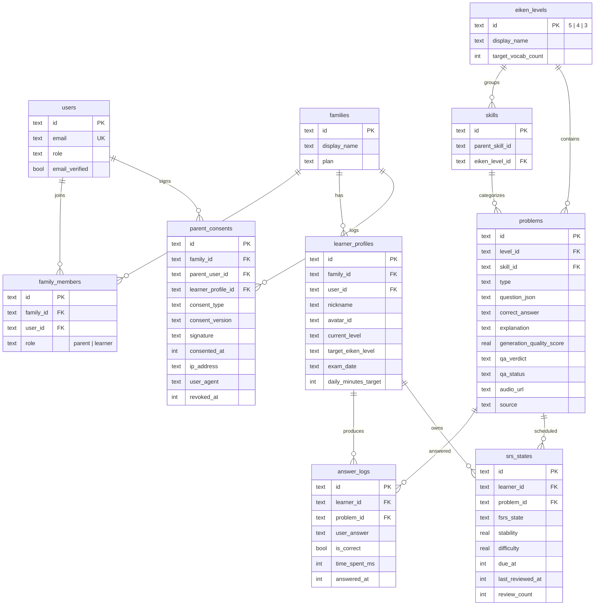

# PRJ-016 HANEI - ER 図 v1 (W1)

- 作成日: 2026-04-26
- 作成者: 開発部門
- 対象: W1 スコープの最小10テーブル
- 完全形 (25テーブル): W2 以降で `dev-phase0.md §2` を実装に展開

## 凡例

- `||--o{` : 1対多
- `||--o|` : 1対0..1
- 太字テーブルは三層認可防衛のスコープ起点 (`families`)

## Mermaid

## 三層認可スコープキー一覧

| テーブル | スコープキー | 備考 |
|---------|------------|------|
| families | (root) | テナント本体 |
| family_members | family_id | UNIQUE (user_id, family_id) |
| parent_consents | family_id | 13歳未満同意ログ |
| learner_profiles | family_id | 子どもプロフィール |
| answer_logs | learner_id -> family_id | learner_profile の family を辿る |
| srs_states | learner_id -> family_id | learner_profile の family を辿る |
| problems / eiken_levels / skills | (グローバルマスタ) | テナント横断 read-only |

## W2 で追加予定のテーブル (dev-phase0.md §2 から)

- `sessions` (Better Auth)
- `accounts` (Better Auth OAuth)
- `verifications` (Better Auth email)
- `daily_plans` (受験日逆算プラン)
- `streaks` / `xp_levels` / `achievements` / `badges` (ゲーミフィケーション)
- `ai_coach_conversations` / `ai_coach_messages` (チャット履歴)
- `mock_exam_results` (模試結果)
- `mastery_estimates` (BKT)
- `audit_logs` (操作監査)
- `generated_problems_queue` (LLM 生成待ちキュー)
- `problem_choices` / `problem_explanations` (problems 拡張)
- `characters` (アバター)

合計 25 テーブルが Phase 1 終了時のターゲット。
