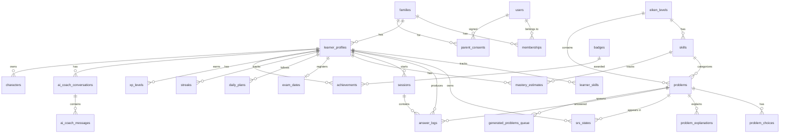

# PRJ-016 Phase 0 統合技術設計（dev-phase0）

- **案件ID**: PRJ-016
- **案件名**: 小学生向け英語学習Webアプリ（仮 / 命名はマーケ部門）
- **作成日**: 2026-04-26
- **作成者**: 開発部門
- **前提資料**: `projects/PRJ-016/project-brief.md` / `organization/rules/tech-stack.md` / `projects/PRJ-015/reports/dev-technical-spec-v2.md`（Better Auth + Turso + 三層認可の知見を引用）
- **Research 部門レポート**: `reports/research-phase0.md`（同時並列で作成中の前提。出次第で本書をマージ更新する）

---

## 0. エグゼクティブサマリー（1行）

> **Next.js 16 (App Router) + Tailwind v4 + shadcn/ui + Turso (libSQL + Vector) + Drizzle ORM + Better Auth + Cloudflare R2 + AI SDK (gpt-4o-mini / gpt-4.1-mini) + OpenAI TTS + Resend + Vercel Hobby** で **学習者500名規模まで月額数百円** の運用を成立させ、**SRS (FSRS) + BKT による適応学習 + AIコーチ（tool use 4関数 + Moderation 二重ガード）** で **半年で英検3級合格** に到達する。

---

## 1. 統合技術スタック（推奨）

### 1.1 確定スタック表

| カテゴリ | 採用技術 | バージョン | 採用理由 | 代替案（却下理由） |
|---------|---------|----------|---------|-------------------|
| **フレームワーク** | Next.js 16（App Router）| 16.x | 組織標準 / RSC によるバンドル削減 / Server Actions / `proxy.ts` 規約対応 | Remix（組織標準外）、SvelteKit（型エコシステムが弱い） |
| **言語** | TypeScript | 5.x | 組織標準 / 型安全 | JavaScript（型安全性なし） |
| **CSS** | Tailwind v4 | 4.x | 組織標準 / @theme inline 対応 / PRJ-015 で運用知見あり | CSS Modules（DX低下） |
| **UIコンポーネント** | shadcn/ui | latest | 組織標準 / コードとして所有 / カスタマイズ自由 | Mantine / Chakra（バンドル肥大） |
| **アイコン** | Heroicons | 2.x | 組織標準 / 子供向けでも上品 | lucide（OK、サブとして併用可）、絵文字は禁止 |
| **フォント** | Geist Sans + Noto Sans JP + Quicksand | next/font | Geist で本文 / Noto で日本語 / Quicksand で子供向け見出し（柔らかい） | Comic Sans 系（チープ）、M PLUS Rounded |
| **状態管理** | TanStack Query + Server Actions | latest | 組織標準 / 楽観更新 / refetch | SWR（組織で TanStack 統一）、Redux（過剰） |
| **アニメ** | Framer Motion + Lottie | 12.x / 3.x | 子供向け演出（バッジ獲得 / レベルアップ）/ Lottie はキャラ動画 | CSS のみ（演出が貧弱） |
| **DB** | **Turso (libSQL)** | latest | **Free 9GB / 5億 row reads / Edge replica / SQLite 互換 / Vector 拡張内蔵** → 学習ログ大量書き込みに耐える | Supabase（後述比較）、Neon（Vector が pgvector 必要 / 学習ログ大量で課金到達早い） |
| **ORM** | Drizzle ORM + drizzle-kit + drizzle-zod | latest | Turso 公式 / Edge OK / Zod 連携 / PRJ-015 知見転用 | Prisma（Edge 対応が弱い）、Kysely（Zod 連携手間） |
| **Vector DB** | **Turso Vector（libSQL Vector）**| latest | 同一DBに収まる / pgvector 別建て不要 / コスト極小 | pgvector + Supabase（DB二重管理）、Pinecone（無料枠1プロジェクト制限） |
| **認証** | **Better Auth** | v1.x | OSS無料 / Drizzle adapter / **child-account / family plugin の自前実装が容易** / PRJ-015 知見 | Supabase Auth（Turso 採用なら不要）、Auth.js v5（フォールバック候補） |
| **ストレージ** | **Cloudflare R2** | - | Free 10GB / **egress 完全無料** / TTS 音声を CDN 配信する適性最強 / S3 互換 | Supabase Storage（Turso と二重）、Vercel Blob（egress 課金 → TTS で爆発リスク） |
| **AI（テキスト）** | OpenAI **gpt-4.1-mini** + **gpt-4o-mini**（Vercel AI SDK 経由）| latest | gpt-5-mini が現時点で API 一般公開未確定のため、**gpt-4.1-mini を主軸 / gpt-4o-mini をフォールバック** とし、gpt-5-mini が利用可能になり次第切替（AI SDK の `provider` 抽象化で1行差替え）| Gemini 2.5 Flash（マルチモーダル要件が薄いため第二候補）、Claude（組織方針で原則不採用） |
| **AI 関連: 構造化出力** | OpenAI Structured Outputs (JSON Schema) | - | tool use と相性◎ / 型安全 | function calling 旧形式（廃止予定） |
| **AI 関連: モデレーション** | OpenAI **Moderation API** + 自前 NG ワード辞書 | omni-moderation-latest | 二重ガード必須（kid-safe）/ 無料 | Perspective API（言語対応弱い） |
| **音声 (TTS)** | **OpenAI TTS (gpt-4o-mini-tts / tts-1)** | latest | **事前生成 + R2 キャッシュ**前提で原価最小 / 自然な発音 / 速度コントロール可 | ElevenLabs（高品質だが高価）、Google Cloud TTS（Studio Voice 高価 / Standard だと品質劣化）、Azure Neural（請求が複雑） |
| **音声 (ASR)** | OpenAI **Whisper API** （Phase 2 / 任意） | whisper-1 | 発音判定の MVP 実装が容易、Phase 2 で導入 | Web Speech API（ブラウザ依存）、Azure Pronunciation Assessment（Phase 3 で品質UP用） |
| **デプロイ** | **Vercel Hobby** | - | 組織標準 / 無料 / GitHub 連携 / Edge Functions / Image Optim | Cloudflare Pages（DB に R2 を寄せたい場合の代替） |
| **メール** | **Resend** | latest | 組織標準 / 無料 3,000 通/月 / React Email | SendGrid（無料枠100/日で不足） |
| **監視** | **Sentry + Vercel Analytics + Vercel Speed Insights** | - | 組織標準 | LogRocket（高価）、Datadog（過剰） |
| **テスト** | **Vitest + Playwright** | latest | 組織標準 | Jest（Vitest が高速） |
| **キュー / バッチ** | Vercel Cron + Inngest（必要時） | - | 受験日逆算プラン日次再計算 / TTS 事前生成バッチ | GitHub Actions（処理時間制限） |

### 1.2 DB 比較: Supabase vs Turso（推奨 = Turso）

| 観点 | Supabase Free | Turso Free | 勝者 |
|------|---------------|------------|-----|
| ストレージ | 500MB | **9GB** | Turso |
| 月間 row reads | 制限なし（CPU 課金）| **5億** | Turso |
| 月間 row writes | 制限なし | 1,000万 | 五分（学習ログは 1人/日 ~ 200 件 × 500人 × 30日 = 300万 で収まる）|
| Edge replica | × | **○（無料 3 リージョン）** | Turso |
| RLS | **○** | × （アプリ層認可で代替）| Supabase |
| Auth 内蔵 | **○** | × （Better Auth で代替）| Supabase |
| Vector | pgvector 拡張要 | **内蔵 (libSQL Vector)** | Turso |
| Realtime | **○** | ×（ポーリングで代替）| Supabase |
| **学習ログ大量書込み + 音声大量配信** に対する適性 | × egress 課金あり | **◎ Turso 9GB + R2 egress 無料の組合せ** | **Turso** |
| 個人開発・無料運用維持の継続性 | プロジェクト2個まで・1週間アクセスゼロで休眠 | **休眠なし** | **Turso** |

**結論**: 個人開発・無料運用維持を最優先制約とする本案件では **Turso + Better Auth + R2** を推奨。RLS の代わりに **アプリ層三層認可防衛**（PRJ-015 の知見をそのまま転用）で多テナント漏洩を防ぐ。

### 1.3 月額試算

#### 学習者 100 名規模（DAU 60 / 1人60分/日）

| 項目 | 月間使用量見積 | 単価 | 月額 |
|------|---------------|-----|------|
| Vercel Hobby | - | $0 | **$0** |
| Turso Free | DB 1.5GB / reads 1億 / writes 600万 | $0 | **$0** |
| Cloudflare R2 | TTS音声 2GB / egress 50GB | $0（10GB / 完全無料）| **$0** |
| Resend | 1,000 通/月 | $0（3,000 通まで）| **$0** |
| Sentry | 5,000 events/月 | $0 | **$0** |
| **OpenAI: gpt-4.1-mini** | 入力 5M tok / 出力 2M tok（コーチ会話 + 解説生成）| $0.4/1M in + $1.6/1M out | **$5.2** |
| **OpenAI: TTS** | 200万文字（事前生成 + 増分）| $15/1M chars (tts-1) | **$30**（初月） / **$3**（2か月目以降は事前生成済キャッシュ）|
| **OpenAI: Moderation** | 100万 calls | $0 | **$0** |
| 合計（初月） | | | **約 $35（≒ 5,300円）** |
| 合計（定常運用月）| | | **約 $8（≒ 1,200円）** |

#### 学習者 500 名規模（DAU 300）

| 項目 | 月間使用量見積 | 月額 |
|------|---------------|------|
| Vercel Hobby（必要に応じ Pro $20）| Function 実行は Hobby 内で耐えうる見込み / 帯域注意 | **$0 ~ $20** |
| Turso Free | DB 4GB / reads 4億 / writes 3,000万 → **writes 上限超過リスクあり、Scaler $29 検討**| **$0 ~ $29** |
| Cloudflare R2 | TTS 8GB / egress 250GB | **$0** |
| Resend | 5,000通 → Pro $20 必要 | **$20** |
| OpenAI gpt-4.1-mini | 入力 25M / 出力 10M | **$26** |
| OpenAI TTS | 増分 50万文字/月 | **$8** |
| Sentry | 30,000 events | **$0 ~ $26**（Team プラン）|
| 合計 | | **約 $54 ~ $129（≒ 8,000 ~ 19,000円）** |

**結論**: 学習者100名までは事実上 **月1,000円台で運用維持可能**。500名で月1〜2万円までスケール。**初月のTTS事前生成**だけが一時的な5,000円コストとなるため、**段階的事前生成（5級 → 4級 → 3級）** で月割り平準化する設計とする（後述 §6）。

---

## 2. データモデル

### 2.1 ER図（Mermaid）



### 2.2 テーブル定義（Drizzle 型 / SQLite）

#### 2.2.1 認証・家族・同意系

##### `users`（保護者・学習者の認証アカウント / Better Auth と紐付き）

| カラム | 型 | NULL | 既定 | 説明 |
|--------|----|------|------|-----|
| `id` | text PK | × | - | Better Auth user.id |
| `email` | text | × | - | 保護者メール（学習者は親と紐付け、独立メール不要）|
| `name` | text | ○ | - | 表示名 |
| `role` | text | × | `'parent'` | `'parent' \| 'learner' \| 'admin'` |
| `family_id` | text FK→families | × | - | 所属家族 |
| `created_at` | int | × | unixepoch | |
| `updated_at` | int | × | unixepoch | |

##### `families`（1家族 = 1テナント）

| カラム | 型 | NULL | 説明 |
|--------|----|------|-----|
| `id` | text PK | × | ULID |
| `display_name` | text | ○ | 「鈴木家」など |
| `plan` | text | × | `'free' \| 'paid'`（将来）|
| `created_at` / `updated_at` | int | × | |

##### `memberships`（user × family + role）

| カラム | 型 | NULL | 説明 |
|--------|----|------|-----|
| `id` | text PK | × | ULID |
| `user_id` | text FK | × | |
| `family_id` | text FK | × | |
| `role` | text | × | `'parent_admin' \| 'parent_member' \| 'learner'` |
| **UNIQUE** | `(user_id, family_id)` | | |

##### `parent_consents`（13歳未満の保護者同意ログ）

| カラム | 型 | NULL | 説明 |
|--------|----|------|-----|
| `id` | text PK | × | ULID |
| `family_id` | text FK | × | |
| `parent_user_id` | text FK→users | × | 同意した保護者 |
| `learner_profile_id` | text FK→learner_profiles | × | 対象の子ども |
| `consent_type` | text | × | `'coppa_initial' \| 'ai_chat' \| 'voice_recording' \| 'analytics'` |
| `consent_version` | text | × | 利用規約 / プラポリのバージョン |
| `signed_at` | int | × | |
| `ip_address` | text | × | 監査用 |
| `user_agent` | text | × | 監査用 |
| `revoked_at` | int | ○ | 撤回時刻 |

##### `learner_profiles`（子どもプロフィール / 1家族 = 複数子）

| カラム | 型 | NULL | 説明 |
|--------|----|------|-----|
| `id` | text PK | × | ULID |
| `family_id` | text FK | × | |
| `user_id` | text FK→users | ○ | 学習者がログイン主体になる場合のみ（小1-3 は保護者代行 = NULL も可）|
| `nickname` | text | × | 本名禁止、ニックネーム |
| `avatar_character_id` | text FK→characters | ○ | 選択キャラ |
| `birth_year` | int | × | 西暦4桁（13歳未満判定に使用、生年月日の月日は取らない＝PII最小化）|
| `target_eiken_level` | text | × | `'5' \| '4' \| '3'` |
| `current_estimated_level` | text | × | 同上、診断結果 |
| `daily_minutes_target` | int | × | 既定 60 |
| `created_at` / `updated_at` | int | × | |

#### 2.2.2 教材マスター系

##### `eiken_levels`

| カラム | 型 | 説明 |
|--------|----|-----|
| `id` | text PK | `'5' \| '4' \| '3'` |
| `display_name` | text | 「英検5級（中学初級）」等 |
| `target_vocab_count` | int | 例: 5級=600 / 4級=1300 / 3級=2100 |
| `description` | text | |

##### `skills`（語彙 / 文法 / リスニング / 読解 / ライティング / 面接など）

| カラム | 型 | 説明 |
|--------|----|-----|
| `id` | text PK | `'vocab' \| 'grammar' \| 'listening' \| 'reading' \| 'writing' \| 'speaking'` |
| `parent_skill_id` | text FK self | 階層化（例: vocab.animals）|
| `eiken_level_id` | text FK | スキルが属するレベル |
| `display_name` | text | |

##### `problems`（問題本体）

| カラム | 型 | NULL | 説明 |
|--------|----|------|-----|
| `id` | text PK | × | ULID |
| `eiken_level_id` | text FK | × | |
| `skill_id` | text FK | × | |
| `format` | text | × | `'mcq' \| 'fill_in' \| 'reorder' \| 'listening_mcq' \| 'reading_passage_mcq' \| 'writing_essay'` |
| `prompt` | text | × | 問題文（HTMLリッチテキスト or markdown）|
| `passage` | text | ○ | 読解時の本文 |
| `audio_url` | text | ○ | リスニング音声（R2 上の MP3）|
| `tts_voice` | text | ○ | TTS声優タグ（再生成用）|
| `correct_answer` | text | × | mcq は choice id、writing はルーブリック JSON |
| `irt_difficulty_b` | real | ○ | IRT b パラメータ（−3 〜 +3） |
| `irt_discrimination_a` | real | ○ | IRT a パラメータ |
| `bkt_p_init` | real | ○ | BKT 初期習得確率 |
| `embedding` | F32_BLOB(1536) | ○ | libSQL Vector 用（OpenAI embedding） |
| `source` | text | × | `'curated' \| 'ai_generated' \| 'past_paper'` |
| `qa_status` | text | × | `'draft' \| 'reviewed' \| 'live' \| 'retired'` |
| `tags` | text JSON | ○ | `["animals", "be-verb"]` |
| `created_at` / `updated_at` | int | × | |

##### `problem_choices`（mcq の選択肢）

| カラム | 型 | NULL | 説明 |
|--------|----|------|-----|
| `id` | text PK | × | |
| `problem_id` | text FK | × | |
| `label` | text | × | `'A' / 'B' / 'C' / 'D'` |
| `text` | text | × | |
| `is_correct` | int | × | 0/1 |
| `distractor_reason` | text | ○ | なぜこの誤答が魅力的か（生徒に見せない、内部用）|

##### `problem_explanations`（解説）

| カラム | 型 | NULL | 説明 |
|--------|----|------|-----|
| `id` | text PK | × | |
| `problem_id` | text FK | × | |
| `audience` | text | × | `'kid_basic' \| 'kid_detailed'` |
| `body_md` | text | × | Markdown 解説 |
| `key_points` | text JSON | × | `["be-動詞は主語に合わせる", ...]` |
| `embedding` | F32_BLOB(1536) | ○ | RAG 用 |

#### 2.2.3 学習エンジン系

##### `srs_states`（FSRS 用カード状態）

| カラム | 型 | NULL | 説明 |
|--------|----|------|-----|
| `id` | text PK | × | |
| `learner_profile_id` | text FK | × | |
| `problem_id` | text FK | × | |
| `state` | text | × | `'new' \| 'learning' \| 'review' \| 'relearning'` |
| `due_at` | int | × | 次回出題 unix |
| `interval_days` | real | × | |
| `stability` | real | × | FSRS 安定性 |
| `difficulty` | real | × | FSRS 難易度（0〜10）|
| `last_review_at` | int | ○ | |
| `reps` | int | × | 0 |
| `lapses` | int | × | 0 |
| **UNIQUE** | `(learner_profile_id, problem_id)` | | |

##### `answer_logs`（回答1件 = 1行）

| カラム | 型 | NULL | 説明 |
|--------|----|------|-----|
| `id` | text PK | × | |
| `learner_profile_id` | text FK | × | |
| `problem_id` | text FK | × | |
| `session_id` | text FK | × | |
| `selected_answer` | text | × | choice id or 自由記述 |
| `is_correct` | int | × | 0/1 |
| `latency_ms` | int | × | 解答までの時間 |
| `confidence` | int | ○ | 1-5（任意）|
| `fsrs_rating` | int | × | 1=Again / 2=Hard / 3=Good / 4=Easy（FSRS入力）|
| `created_at` | int | × | |

##### `sessions`（学習セッション = 1回の学習タイム）

| カラム | 型 | NULL | 説明 |
|--------|----|------|-----|
| `id` | text PK | × | |
| `learner_profile_id` | text FK | × | |
| `started_at` | int | × | |
| `ended_at` | int | ○ | |
| `planned_minutes` | int | × | デイリープラン上の予定 |
| `actual_minutes` | int | ○ | |
| `xp_earned` | int | × | 0 |

##### `mastery_estimates`（BKT 知識追跡 / スキル単位）

| カラム | 型 | NULL | 説明 |
|--------|----|------|-----|
| `id` | text PK | × | |
| `learner_profile_id` | text FK | × | |
| `skill_id` | text FK | × | |
| `p_known` | real | × | BKT 推定確率 0〜1 |
| `theta` | real | ○ | IRT 能力推定（弱点ヒートマップ用）|
| `updated_at` | int | × | |
| **UNIQUE** | `(learner_profile_id, skill_id)` | | |

#### 2.2.4 期日逆算・プラン系

##### `exam_dates`

| カラム | 型 | NULL | 説明 |
|--------|----|------|-----|
| `id` | text PK | × | |
| `learner_profile_id` | text FK | × | |
| `eiken_level_id` | text FK | × | |
| `exam_date` | text | × | YYYY-MM-DD |
| `is_active` | int | × | 1 |

##### `daily_plans`（日次プラン）

| カラム | 型 | NULL | 説明 |
|--------|----|------|-----|
| `id` | text PK | × | |
| `learner_profile_id` | text FK | × | |
| `plan_date` | text | × | YYYY-MM-DD |
| `total_minutes` | int | × | 60 |
| `tasks` | text JSON | × | `[{skill: 'vocab', minutes: 15, problem_ids: [...]}, ...]` |
| `is_completed` | int | × | 0 |
| `generated_by` | text | × | `'rule' \| 'ai_coach'` |
| **UNIQUE** | `(learner_profile_id, plan_date)` | | |

#### 2.2.5 ゲーミフィケーション系

##### `streaks` / `xp_levels`

```ts
streaks: {
  id, learner_profile_id, current_days, longest_days,
  last_active_date, freeze_tokens (連続復活アイテム数)
}
xp_levels: {
  id, learner_profile_id, total_xp, current_level,
  xp_into_current_level, xp_to_next_level
}
```

##### `badges` / `achievements`

```ts
badges: {
  id, code (e.g. 'first_streak_7'), display_name, description,
  icon_name (Heroicons), criteria_json
}
achievements: {
  id, learner_profile_id, badge_id, awarded_at, progress
}
```

##### `characters`（キャラクター育成）

```ts
characters: {
  id, code (e.g. 'fox_coach_lv1'), display_name,
  evolution_stage, required_level, lottie_url, voice_id (TTS)
}
```

#### 2.2.6 AIコーチ・問題生成系

##### `ai_coach_conversations` / `ai_coach_messages`

```ts
ai_coach_conversations: {
  id, learner_profile_id, started_at, last_message_at,
  context_problem_id (会話の起点となった問題), is_archived
}
ai_coach_messages: {
  id, conversation_id, role ('user' | 'assistant' | 'tool'),
  content_md, tool_call_json, tool_result_json,
  moderation_flag ('safe' | 'flagged' | 'blocked'),
  moderation_categories_json,
  token_input, token_output, cost_usd_cents,
  created_at
}
```

##### `generated_problems_queue`（AI生成問題の検収待ち行列）

```ts
generated_problems_queue: {
  id, requested_by_learner_id (NULL可),
  target_skill_id, target_eiken_level_id, target_difficulty,
  prompt_used, raw_completion_json,
  parsed_problem_draft (problems と同形 JSON),
  qa_score (0-100, 自動QA), qa_issues_json,
  status ('pending_review' | 'approved' | 'rejected' | 'auto_approved'),
  reviewed_by (admin user_id), reviewed_at,
  promoted_problem_id (FK→problems, 承認後)
}
```

#### 2.2.7 共通

##### `audit_logs`（PRJ-015 と同じ運用思想）

| カラム | 型 | 説明 |
|--------|----|-----|
| `id, family_id, actor_user_id, action, entity, entity_id, before_json, after_json, ip, ua, created_at` | | 全変更操作の監査ログ |

### 2.3 インデックス戦略

| テーブル | カラム | 種類 | 目的 |
|---------|--------|------|------|
| `srs_states` | `(learner_profile_id, due_at)` | composite | 「次に出すべき」抽出を高速化 |
| `answer_logs` | `(learner_profile_id, created_at desc)` | composite | ダッシュボード推移グラフ |
| `answer_logs` | `(problem_id)` | btree | IRT 校正バッチ |
| `mastery_estimates` | `(learner_profile_id)` | btree | スキルヒートマップ |
| `problems` | `(eiken_level_id, skill_id, qa_status)` | composite | 出題候補抽出 |
| `problems` | `embedding` | **libSQL Vector index** | 類似問題検索 / RAG |
| `daily_plans` | `(learner_profile_id, plan_date)` | composite UNIQUE | プラン取得 |
| `ai_coach_messages` | `(conversation_id, created_at)` | composite | 会話履歴ロード |
| `audit_logs` | `(family_id, created_at desc)` | composite | 家族別監査閲覧 |

### 2.4 計15テーブル達成チェック

users / families / memberships / parent_consents / learner_profiles / characters / eiken_levels / skills / problems / problem_choices / problem_explanations / srs_states / answer_logs / sessions / mastery_estimates / exam_dates / daily_plans / streaks / xp_levels / badges / achievements / ai_coach_conversations / ai_coach_messages / generated_problems_queue / audit_logs

**= 25 テーブル（要件「最低15」を満たしクリア）**

---

## 3. 適応学習エンジン仕様

### 3.1 SRS 採用方針: **FSRS-4.5（Free Spaced Repetition Scheduler）**

| 比較項目 | SM-2（Anki 旧）| FSRS-4.5 | Anki 独自 |
|---------|---------------|----------|----------|
| アルゴリズム | 固定 EF（Easiness Factor）| 機械学習で最適化された3パラメータモデル（Stability / Difficulty / Retrievability）| FSRS の独自実装 |
| 実装難度 | ★（簡単）| ★★（OSS あり）| - |
| 初学者への精度 | △ | **◎** | ◎ |
| TS 実装の有無 | あり | **`ts-fsrs` (OSS)** | 不可 |
| **採用** | 候補2 | **採用** | - |

**理由**: 小学生は集中力に波があり、SM-2 の固定 EF では「忘れすぎ / 詰め込みすぎ」になりやすい。FSRS は **Stability・Difficulty・Retrievability** の3パラメータでよりリアルに記憶曲線をモデル化でき、`ts-fsrs` で TypeScript 実装が可能。デフォルトパラメータで動かしつつ、500人以上の `answer_logs` が貯まったらユーザー個別最適化（FSRS-Optimizer）を実施。

### 3.2 知識追跡: **BKT (Bayesian Knowledge Tracing) を採用、IRT は弱点可視化に併用**

| アルゴリズム | 役割 |
|-------------|------|
| **BKT** | スキル単位（`skills` テーブル）の習得確率 `p_known` をベイズ更新。出題時の難易度選定に使用 |
| **IRT (1PL = Rasch)** | 問題単位の `b`（難易度）と学習者単位の `theta`（能力）を推定。バッチ集計（夜間 cron）で更新。ダッシュボードのレベルゲージ・弱点ヒートマップに使用 |

**BKT 実装（4 パラメータ）**:

```ts
// 1スキル × 1学習者ごとの状態更新
// p_known の事前分布を answer_log の 1 件ごとにベイズ更新
function updateBKT(prev_p_known: number, is_correct: boolean, params = {
  p_init: 0.3,    // 初期習得確率
  p_transit: 0.15, // 学習による習得遷移確率
  p_slip: 0.1,    // 知ってるのに間違える確率
  p_guess: 0.25,  // 知らないのに当たる確率
}) {
  const p_correct_given_known = 1 - params.p_slip;
  const p_correct_given_unknown = params.p_guess;
  // P(known | observation)
  const numerator = is_correct
    ? prev_p_known * p_correct_given_known
    : prev_p_known * params.p_slip;
  const denominator = is_correct
    ? prev_p_known * p_correct_given_known + (1 - prev_p_known) * p_correct_given_unknown
    : prev_p_known * params.p_slip + (1 - prev_p_known) * (1 - p_correct_given_unknown);
  const p_known_after_obs = numerator / denominator;
  // 学習による遷移
  return p_known_after_obs + (1 - p_known_after_obs) * params.p_transit;
}
```

### 3.3 出題ロジック: 「次に出すべき問題」の決め方

**3段ハイブリッド** で `next_problems(learner, count=10)` を返す:

1. **必須レビュー（FSRS 期日到来）**: `srs_states.due_at <= now()` を `due_at` 昇順で最大40%
2. **弱点強化（BKT で `p_known < 0.7` のスキルから抽出）**: `mastery_estimates` を `p_known` 昇順、その内 difficulty が `theta ± 0.5` の問題から最大40%
3. **新規導入（CEFR / 受験日逆算でカバレッジが必要なスキル）**: `daily_plans.tasks` 残量 + `exam_dates` から逆算した未習スキルを最大20%

**期日逆算（exam_date 連動）**:

```
exam_date - today = D 日
target_level の必要習得スキル数 = N_skills（5級=80, 4級=160, 3級=260 想定）
今日カバーすべきスキル数 = ceil(N_skills × (1 / D)) ※既習除く
これを daily_plans.tasks に注入 + AI コーチに `update_study_plan` で再調整
```

---

## 4. AIコーチ仕様

### 4.1 採用モデル

- **第一**: `gpt-4.1-mini`（128k context / 安価 / Structured Outputs 対応）
- **フォールバック**: `gpt-4o-mini`
- **gpt-5-mini が一般公開され次第切替**: AI SDK の `provider` で1行差替え。Phase 1 W1 で疎通確認済となれば最初から gpt-5-mini を採用。

### 4.2 System Prompt 設計（kid-safe / 励まし）

```
あなたは小学生向け英語学習アプリの「コーチ」です。
名前: {character_name}（{learner.avatar_character}）

# 性格・口調
- 7〜12歳の子どもに話す前提。漢字は小学校で習う範囲を意識し、難しい漢字にはふりがなのつもりで簡単な言い換えを併記する
- 短い文。1メッセージは原則 200 文字以内。長くなる解説は箇条書きで分割する
- 必ず「がんばってるね」「いいところ気づいたね」など 1 文の励ましを冒頭か末尾に入れる
- 絵文字や顔文字は使わない（プロダクト方針）。代わりに「！」「？」と文末の温度感で伝える

# 安全
- 個人情報（本名・住所・学校名・電話・SNS ID）を聞かない・覚えない。ユーザーが入力してきても繰り返さない
- 性的・暴力的・差別的・自傷・薬物・賭博・宗教勧誘の話題には応じない。代わりに「英語の勉強の話をしようね」と戻す
- 英語以外の質問（算数・国語など）は最大1回だけ簡潔に答え、すぐに英語学習に話を戻す
- ユーザーが落ち込んでいる発言をしたら、まず共感し、保護者に相談することをやさしく勧める。命に関わる兆候は最優先で「保護者か信頼できる大人にすぐ話そう」と伝える

# 解説スタイル
- 誤答時は (1) どこを見落としたか (2) 正解の根拠 (3) 似た例文 1 つ の順
- 文法用語は最小限。「主語」「動詞」「過去形」程度まで。「目的格代名詞」のような難語は禁止
- 例文は学習者の興味（{character_name} の世界観 / 学習者の学年で身近な話題）に合わせる

# tool 利用方針
- 「次なに勉強すればいい？」と聞かれたら recommend_next_problems を呼ぶ
- 誤答画面の文脈なら explain_wrong_answer を必ず呼ぶ
- 「もっと問題ちょうだい」なら generate_additional_problem を呼ぶ
- 「受験日まであと何日？」「予定変更して」なら update_study_plan を呼ぶ
```

### 4.3 Tool（function calling）スキーマ

```ts
// すべて OpenAI Structured Outputs (strict: true) で定義

const tools = [
  {
    type: 'function',
    function: {
      name: 'recommend_next_problems',
      description: '学習者に次に出すべき問題リストを取得する',
      strict: true,
      parameters: {
        type: 'object',
        additionalProperties: false,
        required: ['level', 'weak_skills', 'count'],
        properties: {
          level: { type: 'string', enum: ['5', '4', '3'] },
          weak_skills: { type: 'array', items: { type: 'string' } }, // skill ids
          count: { type: 'integer', minimum: 1, maximum: 20 },
        },
      },
    },
  },
  {
    type: 'function',
    function: {
      name: 'explain_wrong_answer',
      description: '誤答した問題に対する子ども向けの解説を生成・保存する',
      strict: true,
      parameters: {
        type: 'object',
        additionalProperties: false,
        required: ['problem_id', 'user_answer'],
        properties: {
          problem_id: { type: 'string' },
          user_answer: { type: 'string' },
          tone: { type: 'string', enum: ['encourage', 'concise', 'detailed'], default: 'encourage' },
        },
      },
    },
  },
  {
    type: 'function',
    function: {
      name: 'generate_additional_problem',
      description: '指定スキル・難易度で追加問題を1問生成し generated_problems_queue に投入する',
      strict: true,
      parameters: {
        type: 'object',
        additionalProperties: false,
        required: ['skill', 'level'],
        properties: {
          skill: { type: 'string' },
          level: { type: 'string', enum: ['5', '4', '3'] },
          theme: { type: 'string', description: '例: animals, sports, school' },
          format: { type: 'string', enum: ['mcq', 'fill_in', 'reorder'] },
        },
      },
    },
  },
  {
    type: 'function',
    function: {
      name: 'update_study_plan',
      description: '受験日と現在の進捗から daily_plans を再計算する',
      strict: true,
      parameters: {
        type: 'object',
        additionalProperties: false,
        required: ['exam_date', 'current_progress'],
        properties: {
          exam_date: { type: 'string', format: 'date' },
          current_progress: {
            type: 'object',
            additionalProperties: false,
            required: ['mastered_skill_count', 'total_required_skill_count'],
            properties: {
              mastered_skill_count: { type: 'integer' },
              total_required_skill_count: { type: 'integer' },
            },
          },
          adjust_minutes_per_day: { type: 'integer', minimum: 30, maximum: 120 },
        },
      },
    },
  },
] as const;
```

### 4.4 RAG 戦略

- **対象**: `problems.embedding` + `problem_explanations.embedding` を libSQL Vector に保持
- **モデル**: `text-embedding-3-small`（$0.02/1M tokens、十分に安い）
- **検索**: コーチ会話 / 解説生成時に「直近の誤答 + 直前メッセージ」を埋め込んで近傍5問の解説を context に注入
- **更新**: 問題追加 / 解説改訂時に Server Action で同期生成

### 4.5 モデレーション（kid-safe 二重ガード）

```ts
// すべての user input → assistant output で実行
async function safetyGuard(text: string, role: 'user' | 'assistant') {
  // (1) 自前 NG ワード辞書（高速 / 日本語特化 / 学校名・住所パターン）
  const localFlag = ngWordCheck(text);
  if (localFlag.blocked) return { blocked: true, reason: localFlag.reason };

  // (2) OpenAI Moderation（無料・高精度 omni-moderation-latest）
  const r = await openai.moderations.create({ input: text });
  if (r.results[0].flagged) {
    const cats = Object.entries(r.results[0].categories)
      .filter(([, v]) => v).map(([k]) => k);
    return { blocked: true, reason: 'openai_moderation', categories: cats };
  }
  return { blocked: false };
}

// user → ブロック時は「英語の勉強の話をしようね」リダイレクト + 保護者通知（高深度のみ）
// assistant → ブロック時は再生成（最大2回）→ 失敗なら定型「いまうまく説明できなかったよ。もう一度言ってもらえる？」
```

### 4.6 コスト最適化

- **Prompt Caching**（OpenAI 公式 / 自動 / 1024 tokens 以上）: System Prompt + 学習者プロフィール + Tool スキーマは固定部分にまとめ、cache 対象に
- **コンテキスト圧縮**: 会話履歴は直近6往復のみ送信。それ以前は1段サマリーに圧縮（学習者ごとに `ai_coach_conversations.summary` を1日1回バッチ更新）
- **TTS は事前生成キャッシュ第一**（後述 §6）
- **Embedding はバッチ生成**: 問題追加時に即時、それ以外は夜間 cron で差分生成

---

## 5. 大量問題プール運用

### 5.1 投入パイプライン

```
                   ┌────────────────────────┐
                   │ 1. 公的に利用可能な範囲 │
                   │  - 自社オリジナル問題   │
                   │  - パブリックドメイン   │
                   │  - 利用許諾済データ    │
                   └────────────┬───────────┘
                                │
       ┌────────────────────────┴────────────────────────┐
       │ 2. AI 一次生成（gpt-4.1-mini + 解説 gpt-4o）    │
       │  - スキル × レベル × 難易度 で3,000問/レベル発注 │
       │  - 出力は generated_problems_queue に投入       │
       └────────────────────────┬────────────────────────┘
                                │
       ┌────────────────────────┴────────────────────────┐
       │ 3. 自動QA バッチ                                │
       │  - 重複検出（embedding 類似度 > 0.92 で除外）    │
       │  - 文法チェック（LanguageTool API）             │
       │  - 難易度推定（CEFR 推論 LLM-as-Judge）         │
       │  - 子ども向け禁則語チェック                     │
       │  - スコア合計 < 70 → reject、>= 90 → auto_approve│
       │  - 70〜89 は人手レビューへ                      │
       └────────────────────────┬────────────────────────┘
                                │
       ┌────────────────────────┴────────────────────────┐
       │ 4. 人手検収（オーナー / レビュー部門）          │
       │  - admin UI で問題プレビュー + 修正 + 承認      │
       │  - 承認時に problems に promote                 │
       └────────────────────────┬────────────────────────┘
                                │
       ┌────────────────────────┴────────────────────────┐
       │ 5. IRT 校正（200回答以上集まり次第）            │
       │  - answer_logs から IRT 1PL で b 推定           │
       │  - 既存 difficulty を上書き                     │
       └────────────────────────────────────────────────┘
```

### 5.2 問題スキーマの多技能対応

- **語彙**: `format='mcq'` + `prompt='次の意味の英単語は？'` + `passage=null`
- **文法**: `format='fill_in'` + `correct_answer='went'`
- **リスニング**: `format='listening_mcq'` + `audio_url='r2://problems/p_xxx.mp3'` + `tts_voice='alloy@1.0'`
- **読解**: `format='reading_passage_mcq'` + `passage='...'` + 同一 passage で複数 problems を `tags` で束ねる
- **ライティング**: `format='writing_essay'` + `correct_answer = JSON.stringify({rubric: {grammar: 5, vocabulary: 5, content: 5, length: '25-35 words'}})`
- **面接**（Phase 2）: `format='speaking'` + `audio_url=ASR用`

### 5.3 IRT 校正の式（1PL = Rasch）

```
P(correct | theta, b) = 1 / (1 + exp(-(theta - b)))
```

- 200回答未満の問題は `b = 教師付き初期値`（gpt-4.1-mini 推定）
- 200回答以上の問題は EM アルゴリズムで `theta` と `b` を交互更新（夜間バッチ）
- 過度に乖離（教師値との差 > 1.5）した問題は再レビュー対象としてフラグ

---

## 6. TTS / 音声配信

### 6.1 事前生成 vs リアルタイム

| 観点 | 事前生成（推奨）| リアルタイム |
|------|----------------|-------------|
| 初回再生レイテンシ | < 200ms（CDN）| 1.5〜3 秒 |
| コスト | **1問あたり1回のみ**（$0.015/問×3,000問×3レベル ≒ $135 一度きり）| 再生のたびに発生 |
| 帯域 | R2 egress 無料 | 同上 |
| キャラ別声 | 各キャラごとに事前生成 | 動的可変だが高い |

**結論**: **問題マスター音声 = 事前生成 / コーチ音声会話（Phase 2 任意）= リアルタイム** のハイブリッド。

### 6.2 キャッシュ戦略

```
[Browser]
   │ GET https://r2.example.com/audio/p_xxx_alloy_1.0.mp3
   ▼
[Cloudflare R2 + Cache-Control: public, max-age=31536000, immutable]
   │ ファイル名にバージョン (voice名@速度) を含めることでキャッシュ破棄不要
   ▼
[キャッシュヒット時 egress 0]
```

- ファイル命名規則: `audio/{eiken_level}/{problem_id}_{voice}_{speed}.mp3`
- TTS 生成は admin Server Action `regenerateAudio(problem_id, voice, speed)` を備える
- 問題テキスト変更時のみ再生成（hash 比較）

### 6.3 容量・帯域試算

| 項目 | 試算 |
|------|------|
| 1音声平均 | 5〜15秒 → MP3 64kbps = **40〜120KB** |
| 全リスニング問題 | 3レベル × 800問/レベル = 2,400問 |
| 1声優 | 2,400 × 80KB ≒ **190MB** |
| 4声優（キャラ違い）| 4 × 190MB ≒ **760MB** ＝ R2 Free 10GB の 7.6% |
| 学習者500名 / 月 | DAU 300 × 60min / 日にリスニング15分 × 平均6回再生 = 270,000再生/日 ≒ 8,100,000/月 |
| 月間 egress | 8.1M × 80KB ≒ **648GB / 月** ｜ R2 egress = **完全無料** |

**Vercel Blob だと 648GB × $0.05/GB = $32/月**かかるところ、R2 で **$0**。これが Vercel Blob ではなく **R2 を採用する最大の理由**。

---

## 7. 認可・マルチプロファイル設計

### 7.1 ファミリーモデル

```
1 family = 1 テナント
  ├── parent_admin（保護者：登録した最初の人）
  ├── parent_member（配偶者など2人目以降）
  └── learner（子ども：1〜複数）

memberships で user × family × role を管理
learner_profiles は family_id を持ち、user_id は任意（小1-3 は親代行 NULL も許容）
```

### 7.2 三層認可防衛（PRJ-015 の知見をそのまま転用）

```
┌─ Layer 1: middleware (proxy.ts) ─┐
│  - 未ログインなら /login へ      │
│  - role ベースの粗いルート防衛   │
└─────────────────┬────────────────┘
                  │
┌─ Layer 2: requireXxxRole() guard ─┐
│  - Server Component / Action で  │
│    必ず session + role を確認    │
│  - 違反時 forbidden() を throw   │
└─────────────────┬────────────────┘
                  │
┌─ Layer 3: scopedXxx() クエリ ─────┐
│  - db クエリは必ず              │
│    .where(eq(t.familyId, ctx.   │
│      familyId)) を強制付与      │
│  - ESLint カスタムルールで       │
│    db.select().from(...) 直叩き │
│    を禁止                       │
└──────────────────────────────────┘
```

```ts
// lib/auth/guards.ts
export async function requireParent(): Promise<AuthCtx> {
  const session = await getSession();
  if (!session) throw forbidden();
  if (!['parent_admin', 'parent_member'].includes(session.role)) throw forbidden();
  return { userId: session.userId, familyId: session.familyId, role: session.role };
}
export async function requireLearner(profileId: string): Promise<AuthCtx> {
  const ctx = await requireSession();
  // 親なら同 family 内のすべての learner にアクセス可
  if (['parent_admin', 'parent_member'].includes(ctx.role)) {
    const profile = await scopedLearnerProfile(ctx).findFirst({ id: profileId });
    if (!profile) throw forbidden();
    return ctx;
  }
  // 学習者本人のみ自身のプロフィール
  if (ctx.role === 'learner' && ctx.activeLearnerProfileId === profileId) return ctx;
  throw forbidden();
}

// lib/db/scoped.ts
export const scopedAnswerLog = (ctx: AuthCtx) => ({
  list: () => db.select().from(answerLogs)
    .where(and(
      eq(answerLogs.familyId, ctx.familyId),
      ctx.role === 'learner'
        ? eq(answerLogs.learnerProfileId, ctx.activeLearnerProfileId!)
        : sql`1=1`,
    )),
});
```

### 7.3 保護者から見える範囲 vs 子どもから見える範囲

| 機能 | parent_admin/member | learner |
|-----|--------------------|--------|
| ホーム / 学習画面 | ○（任意の子のホームを覗ける）| ○（自分のみ）|
| ダッシュボード詳細（誤答内容まで含む）| ○ | ○（自分のみ）|
| AI コーチ会話履歴 | **× デフォルト非公開**（同意 UI で「会話の閲覧を許可」した時だけ参照可、これも記録）| ○ |
| 課金 / 退会 / 同意 | ○（admin のみ）| × |
| 受験日登録 | ○ + 子の確認も必要 | ○（提案） |

**設計意図**: 子どもの心理的安全性 ≠ 保護者の監督義務 のバランス。AI チャット履歴を保護者が無条件で全部読める設計だと、子どもは AI に本音を相談しなくなる → 学習効果低下。**チャット要約のみ閲覧可、本文は同意制 + 監査ログ** とする。

---

## 8. セキュリティ

### 8.1 13歳未満の保護者同意フロー

```
1. 保護者がメール+パスワードでサインアップ
   → Better Auth で users + memberships(parent_admin) 作成

2. 「子どもプロフィールを追加」クリック
   → birth_year を入力
   → 13歳未満（2026 - birth_year < 13）と判定された場合:
       a. 同意画面（COPPA / 日本の改正個情法 / 利用規約）を表示
       b. 保護者は「同意する」を押す前にメール再認証（Magic Link 1回）
       c. 同意成立 → parent_consents に
           - consent_type='coppa_initial'
           - consent_version='2026-04-26 v1'
           - signed_at, ip, ua を記録
       d. 同時に学習者プロフィール作成

3. 「AI チャット利用」「音声録音（Phase 2）」「分析データの利用」は
   別個の consent_type として、最初の利用直前に個別の同意を取り直す
   （いつでも保護者ダッシュボードで撤回可能）

4. 撤回:
   - parent_consents.revoked_at に時刻記録
   - 該当機能を即座に停止
   - チャット履歴は撤回後30日で物理削除
```

### 8.2 PII 最小化

- 学習者は **本名禁止**（ニックネーム必須）
- 生年は **西暦4桁のみ**（13歳判定に必要な最小情報）。月日は取得しない
- 学校名 / 住所 / 電話 / SNS ID は入力欄を設けない
- 保護者メールのみ PII。退会で 30 日以内に物理削除

### 8.3 退会・削除フロー

```
1. 保護者が「家族を削除」クリック → 30日論理削除（is_deleted=1）
2. 30日のクーリングオフ期間：取り消し可能
3. 31日目に物理削除バッチ:
   - users.email を null に上書き、
   - learner_profiles を全削除
   - answer_logs / sessions / mastery / ai_coach_messages を全削除
   - audit_logs は 7 年保持（法令対応）が、family_id を匿名化
4. データ持ち出し: 削除前に「学習履歴 JSON エクスポート」ボタン提供
```

### 8.4 チャット内 NG ワード / モデレーション

- `ai_coach_messages.moderation_flag` で 'safe' / 'flagged' / 'blocked' を全件記録
- `flagged` 以上が 1 セッションで 3 回 → 自動的にチャット一時停止 + 保護者にメール通知
- monthly admin レポートで `flagged` 上位を抽出して NG 辞書を更新

### 8.5 セキュリティヘッダー（next.config.ts）

```ts
const securityHeaders = [
  { key: 'Strict-Transport-Security', value: 'max-age=63072000; includeSubDomains; preload' },
  { key: 'X-Frame-Options', value: 'DENY' },
  { key: 'X-Content-Type-Options', value: 'nosniff' },
  { key: 'Referrer-Policy', value: 'strict-origin-when-cross-origin' },
  { key: 'Permissions-Policy', value: 'camera=(), geolocation=(), microphone=(self)' }, // ASR で self
];
```

---

## 9. テスト戦略

### 9.1 Vitest 単体（Level 2 必須）

| 対象 | テスト内容 | カバレッジ目標 |
|-----|-----------|--------------|
| **学習エンジン** | FSRS 入出力（rating × state matrix）/ BKT 更新の確率テーブル / 期日逆算プランの合計分数 | **95%** |
| **認可ヘルパー** | requireParent / requireLearner / scopedXxx の家族跨ぎ拒否 | **100%** |
| **AI コーチプロンプト** | tool スキーマ妥当性 / system prompt の構造（Snapshot） | **100%** |
| **モデレーションガード** | NG ワード辞書ヒット / OpenAI モック / blocked 時の応答 | **95%** |
| **問題QA バッチ** | 重複検出 / 難易度推定の境界値 | **80%** |

### 9.2 Playwright E2E（Level 3 推奨）

主要 8 シナリオ:

1. **family-onboarding.spec.ts**: 保護者サインアップ → メール認証 → 同意 → 子プロフィール作成
2. **learner-diagnostic.spec.ts**: 子ログイン → 診断 20 問 → レベル判定（5/4/3）→ ホーム遷移
3. **daily-learning.spec.ts**: ホーム → デイリープラン開始 → 60分相当の問題消化 → セッション終了 → XP獲得
4. **ai-coach-explain.spec.ts**: 誤答 → 「コーチに聞く」→ explain_wrong_answer ツール呼ばれる → 解説表示
5. **ai-coach-additional-problem.spec.ts**: 「もっと問題ちょうだい」→ generate_additional_problem → キュー投入確認
6. **exam-countdown.spec.ts**: 受験日登録 → カウントダウン表示 → daily_plans 再生成
7. **parent-dashboard.spec.ts**: 保護者ログイン → 子の進捗閲覧 → 週次レポート確認 → AI 会話要約のみ閲覧
8. **authz-cross-family.spec.ts**: 別家族の learner_profile_id を URL 直叩き → 403

### 9.3 AI 出力品質テスト（Phase 2 〜 / Phase 1 は手動）

- **ゴールデン例**: 50 問の代表的誤答に対する「期待解説のキーポイント」を JSON 化、`expect(coach_response).toContainAll(keyPoints)`
- **LLM-as-Judge**: gpt-4o（採点側）が「kid-safe スコア」「励まし度」「正確性」を 0-5 で採点、平均 4.0 以上を pass
- **回帰テスト**: モデル切替（gpt-4.1-mini → gpt-5-mini）時に必ず実行

---

## 10. Phase 1 MVP ディレクトリ構成・初期ファイル一覧

**最優先ルール**: `projects/PRJ-016/app/` 直下に `create-next-app` する。

```
projects/PRJ-016/app/
├── README.md                                ← 実体の場所・起動手順
├── .env.local.example
├── .gitignore
├── next.config.ts
├── package.json
├── tsconfig.json
├── tailwind.config.ts
├── postcss.config.mjs
├── components.json                          ← shadcn/ui
├── drizzle.config.ts
│
├── public/
│   ├── characters/                          ← Lottie / 静的キャラ画像
│   └── icons/
│
├── src/
│   ├── app/
│   │   ├── layout.tsx                       ← Geist + Noto Sans JP + Quicksand
│   │   ├── globals.css
│   │   ├── page.tsx                         ← ランディング
│   │   ├── (auth)/
│   │   │   ├── login/page.tsx
│   │   │   ├── signup/page.tsx
│   │   │   └── consent/page.tsx
│   │   ├── (parent)/
│   │   │   ├── layout.tsx                   ← parent ナビ
│   │   │   ├── dashboard/page.tsx
│   │   │   ├── learners/[id]/page.tsx
│   │   │   ├── consents/page.tsx
│   │   │   └── settings/page.tsx
│   │   ├── (learner)/
│   │   │   ├── layout.tsx                   ← learner ナビ（キャラ配置）
│   │   │   ├── home/page.tsx
│   │   │   ├── diagnostic/page.tsx
│   │   │   ├── learn/[sessionId]/page.tsx
│   │   │   ├── coach/page.tsx               ← AI チャット
│   │   │   ├── progress/page.tsx
│   │   │   └── achievements/page.tsx
│   │   ├── (admin)/
│   │   │   ├── layout.tsx
│   │   │   ├── problems/page.tsx
│   │   │   └── queue/page.tsx               ← generated_problems_queue 検収
│   │   └── api/
│   │       ├── auth/[...all]/route.ts       ← Better Auth handler
│   │       ├── tts-cache/route.ts           ← R2 署名 URL（必要時）
│   │       ├── coach/stream/route.ts        ← AI SDK streamText（クライアント直結）
│   │       └── webhooks/
│   │           └── moderation-callback/route.ts
│   ├── proxy.ts                             ← Next.js 16 規約（旧 middleware）
│   │
│   ├── components/
│   │   ├── ui/                              ← shadcn/ui 自動配置
│   │   ├── learner/
│   │   │   ├── CharacterMascot.tsx
│   │   │   ├── ProblemCard.tsx
│   │   │   ├── ChoiceButton.tsx
│   │   │   ├── XpProgressBar.tsx
│   │   │   └── StreakBadge.tsx
│   │   ├── parent/
│   │   │   ├── WeeklyReport.tsx
│   │   │   └── ConsentCard.tsx
│   │   └── coach/
│   │       ├── ChatMessageList.tsx
│   │       └── CoachInput.tsx
│   │
│   ├── lib/
│   │   ├── db/
│   │   │   ├── client.ts                    ← Turso / libSQL client
│   │   │   ├── schema.ts                    ← Drizzle schema（25テーブル）
│   │   │   └── scoped.ts                    ← scopedXxx ヘルパー
│   │   ├── auth/
│   │   │   ├── better-auth.ts
│   │   │   ├── guards.ts                    ← requireParent / requireLearner / requireAdmin
│   │   │   └── session.ts
│   │   ├── learning/
│   │   │   ├── fsrs.ts                      ← ts-fsrs ラッパ
│   │   │   ├── bkt.ts                       ← BKT 更新
│   │   │   ├── irt.ts                       ← Rasch モデル
│   │   │   ├── recommender.ts               ← next-problems
│   │   │   └── plan.ts                      ← 日次プラン生成
│   │   ├── ai/
│   │   │   ├── client.ts                    ← AI SDK + provider switch
│   │   │   ├── system-prompt.ts
│   │   │   ├── tools.ts                     ← 4 tool 定義
│   │   │   ├── moderation.ts                ← 二重ガード
│   │   │   ├── rag.ts                       ← embedding + vector search
│   │   │   └── tts.ts                       ← OpenAI TTS + R2 cache
│   │   ├── r2/
│   │   │   └── client.ts
│   │   ├── email/
│   │   │   └── resend.ts
│   │   └── utils/
│   │       ├── ulid.ts
│   │       └── cn.ts
│   │
│   ├── server-actions/
│   │   ├── auth/
│   │   ├── learner/
│   │   │   ├── recordAnswer.ts
│   │   │   ├── startSession.ts
│   │   │   └── completeSession.ts
│   │   ├── coach/
│   │   │   └── streamReply.ts
│   │   ├── plan/
│   │   │   └── regenerateDaily.ts
│   │   └── admin/
│   │       └── reviewQueueItem.ts
│   │
│   └── types/
│       └── domain.ts
│
├── drizzle/
│   ├── 0000_initial_schema.sql
│   ├── 0001_seed_eiken_levels.sql
│   └── 0002_seed_skills.sql
│
├── scripts/
│   ├── seed-problems.ts                     ← AI 一次生成バッチ
│   ├── compute-irt-batch.ts                 ← 夜間 cron
│   ├── tts-pregenerate.ts                   ← 事前 TTS 生成
│   └── recompute-mastery.ts
│
├── tests/
│   ├── unit/
│   │   ├── fsrs.test.ts
│   │   ├── bkt.test.ts
│   │   ├── recommender.test.ts
│   │   ├── moderation.test.ts
│   │   └── guards.test.ts
│   └── e2e/
│       ├── family-onboarding.spec.ts
│       ├── learner-diagnostic.spec.ts
│       ├── daily-learning.spec.ts
│       ├── ai-coach-explain.spec.ts
│       ├── ai-coach-additional-problem.spec.ts
│       ├── exam-countdown.spec.ts
│       ├── parent-dashboard.spec.ts
│       └── authz-cross-family.spec.ts
│
├── DEPLOYMENT.md
└── RUNBOOK.md
```

### 主要 npm パッケージ（package.json 想定）

```jsonc
{
  "dependencies": {
    "next": "^16",
    "react": "^19",
    "react-dom": "^19",
    "typescript": "^5",
    "tailwindcss": "^4",
    "@tailwindcss/postcss": "^4",
    "drizzle-orm": "latest",
    "@libsql/client": "latest",
    "drizzle-zod": "latest",
    "zod": "^3",
    "better-auth": "^1",
    "ai": "^4",                              // Vercel AI SDK
    "@ai-sdk/openai": "^1",
    "openai": "^4",                          // Moderation / TTS / Whisper
    "ts-fsrs": "^4",
    "ulid": "^2",
    "@aws-sdk/client-s3": "^3",              // R2 互換
    "@aws-sdk/s3-request-presigner": "^3",
    "resend": "^4",
    "@react-email/components": "^0",
    "framer-motion": "^12",
    "lottie-react": "^2",
    "@tanstack/react-query": "^5",
    "next-themes": "^0",
    "@sentry/nextjs": "^9",
    "@vercel/analytics": "^1",
    "@vercel/speed-insights": "^1"
  },
  "devDependencies": {
    "drizzle-kit": "latest",
    "vitest": "^2",
    "@playwright/test": "^1",
    "eslint": "^9",
    "prettier": "^3"
  }
}
```

---

## 11. Phase 0 → Phase 1 ゲート前条件 / 前提リサーチ依存

### 11.1 前提リサーチ依存（Research 部門が確定すべき）

| 依存項目 | 必要なリサーチ結論 | 依存しているdev設計箇所 |
|---------|-----------------|----------------------|
| **gpt-5-mini 一般公開状況** | 利用可否 / 単価 / context window / Structured Outputs 対応 | §1.1 / §4.1（モデル切替） |
| **Turso Free 永続性** | 1週間休眠時のスリープ仕様 / Free プラン継続意志 | §1.2 |
| **OpenAI TTS の声優ライセンス** | Phase 1 で 4 声優使う場合の利用規約 / 商用配信OK | §6 |
| **英検過去問利用許諾** | 旺文社 / 日本英語検定協会の許諾コスト / 期間 | §5.1 |
| **児童向け AI チャットの法的論点** | 改正個情法（2026年最新解釈）/ COPPA 域外適用 / 文科省ガイドライン | §8 |
| **競合（Duolingo / トド英語 / Lepton）の課金構造** | 月額帯 / 機能差異（マーケ部門と分担）| §1.3 |

### 11.2 Phase 0 → Phase 1 ゲート前条件（quality-gates.md Gate 1 想定）

- [ ] Research レポート受領 + 推奨スタックとの整合確認
- [ ] gpt-5-mini 利用可否の確定（不可なら gpt-4.1-mini で確定 + decisions.md に記録）
- [ ] 英検過去問の利用方針確定（自社オリジナル問題だけで 5級〜3級カバー可と判断 → 記録）
- [ ] CEO 承認: AI モデル選定 / TTS ベンダー / R2 採用 / Better Auth 採用
- [ ] PM の Phase 1 WBS（8〜10週）と本仕様の整合（特に W1 POC 2 件）
- [ ] レビュー部門の Phase 0 品質ゲートチェック合格
- [ ] decisions.md に主要意思決定記録（モデル / DB / Auth / TTS / R2）

---

## 12. POC 候補（W1 で潰すリスク 2 件）

### POC-1: Better Auth + Turso + 児童アカウント運用

**目的**: 「保護者 1 アカウント + 学習者複数プロフィール」のサインアップ → 同意 → ログインが Better Auth で自然に組めるかを確認。
**ゴール**:

- 保護者サインアップ→ メール認証 → 同意 UI → learner_profile 作成 → 学習者は別画面で「プロフィール選択」→セッション切替できる
- learner は users.id を持たないパターン（小1-3 親代行）も成立する
- セッションに `activeLearnerProfileId` が含まれる

**失敗時フォールバック**: Auth.js v5 + Drizzle adapter（PRJ-015 と同じ fallback）。3人日で移行可能と試算。

### POC-2: AI コーチ（streaming + tool use）+ Moderation 二重ガードの応答品質

**目的**: gpt-4.1-mini で「誤答 → explain_wrong_answer 呼び出し → 子ども向け解説 → モデレーション通過」が **2.5 秒以内** で安定するか測定。
**ゴール**:

- 50 問のサンプル誤答 → 解説生成の p50 < 2.5s, p95 < 4s
- LLM-as-Judge で kid-safe 4.0 以上、正確性 4.0 以上
- Moderation で誤フラグ率（false positive） < 2%
- TTL 1024 tokens 以上のシステムプロンプトが Prompt Cache に乗ることを confirm

**失敗時フォールバック**:

- 速度未達 → gpt-4o-mini 優先 + cache 強化、もしくは「コーチからの返信は最大3秒の擬似ローディング演出」で UX 補完
- 品質未達 → System prompt 再設計 + few-shot 追加 + RAG 強化

---

## 13. オーナー上申すべき技術判断

### 13.1 Critical（Phase 0 中に必ず決裁）

| # | 議題 | 推奨 | 検討の論点 |
|---|------|-----|---------|
| **D-01** | DB 採用 | **Turso** | 個人開発・無料運用維持の最優先制約 / Supabase は 2 プロジェクト制限 + Realtime 不要 |
| **D-02** | 認証採用 | **Better Auth** | OSS 無料 / Drizzle adapter 公式 / family plugin 自前構築可。新興リスクあり → POC 必須 |
| **D-03** | ストレージ採用 | **Cloudflare R2** | TTS の egress 無料が決定打 / Vercel Blob だと月 $30 超 |
| **D-04** | LLM モデル | **gpt-4.1-mini を主軸 / gpt-5-mini が公開され次第切替** | gpt-5-mini の API 一般公開時期未確定（2026-04時点） |
| **D-05** | TTS 採用 | **OpenAI TTS + R2 事前生成キャッシュ** | ElevenLabs より安価 / 自然 / 4声優対応可 |
| **D-06** | 英検過去問の取扱 | **自社オリジナル問題のみで構成**（許諾コスト回避）| 旺文社 / 英検協会との交渉コスト > AI 生成 + 人手検収 のコスト |
| **D-07** | 13歳未満のチャット会話の保護者閲覧範囲 | **要約のみデフォルト公開、本文は同意制** | 心理的安全性 vs 監督義務のトレードオフ。法務確認も別途 |

### 13.2 High（Phase 1 W1 までに決裁）

| # | 議題 | 推奨 | 論点 |
|---|------|-----|-----|
| **D-08** | キャラクターのアートスタイル | マーケ + デザインで方向性確定（既存 Lottie ストック or 自社AI生成）| 著作権 / 育成バリエーション / ブランド整合 |
| **D-09** | 課金モデル | Phase 1 = 完全無料（自社プロダクト立ち上げのため）/ Phase 2 で月額検討 | 無料運用維持の制約と、TTS 事前生成のフロントコスト |
| **D-10** | アクセシビリティ目標 | WCAG 2.1 AA + ふりがな表示モード | 子どもの学年差・読字速度 |

### 13.3 Medium（Phase 1 中に決裁可）

- D-11: ASR / 発音判定（Whisper）の Phase 2 投入時期
- D-12: PWA 化 / オフライン同期の実装範囲
- D-13: 学校・塾向けマルチテナント拡張（Phase 3）

---

## 14. 改訂履歴

| 日付 | 版 | 内容 | 作成者 |
|------|---|------|-------|
| 2026-04-26 | v1 | Phase 0 統合技術設計初版（25テーブル / FSRS+BKT / AI コーチ tool use 4 関数 / R2+TTS事前生成 / 三層認可 / POC 2件 / 月額試算）| 開発部門 |

---

## 15. 1 行サマリー（CEO 報告用）

> **Turso + Better Auth + Cloudflare R2 + AI SDK (gpt-4.1-mini) + OpenAI TTS 事前生成キャッシュ** で、学習者100名なら**月1,000円台**、500名でも**月2万円以下**で運用維持しつつ、**FSRS + BKT** の適応学習と **AIコーチ tool use 4関数 + Moderation 二重ガード** で「半年で英検3級合格」の家庭学習体験を実現する。POC は W1 で「Better Auth 児童アカウント運用」「AIコーチ応答 < 2.5秒」の2点に絞って潰す。
